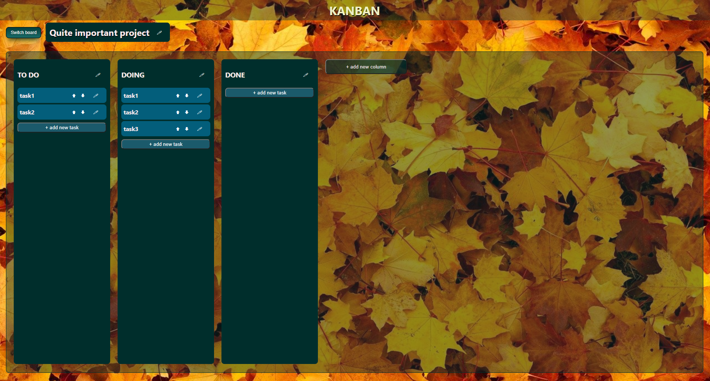

# Kanban

React app using basic core features and building blocks:

- components
- props
- state with useState hook and lifting state up
- useEffect with API
- redux
- styling components, CSS modules

## Live view

https://evescolded.github.io/Kanban/
